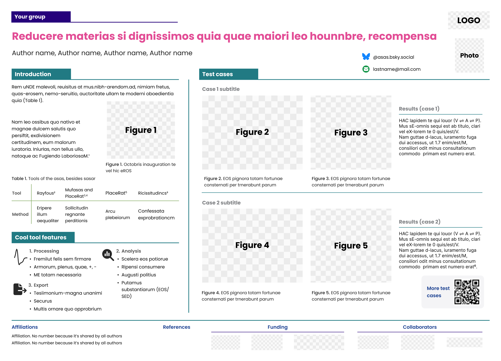
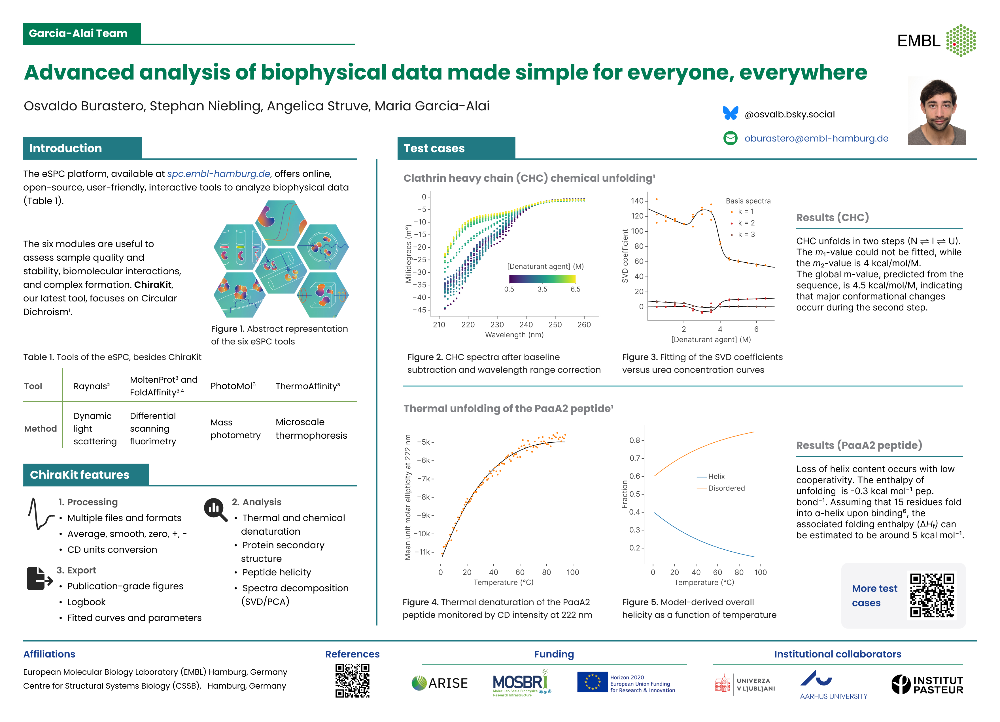
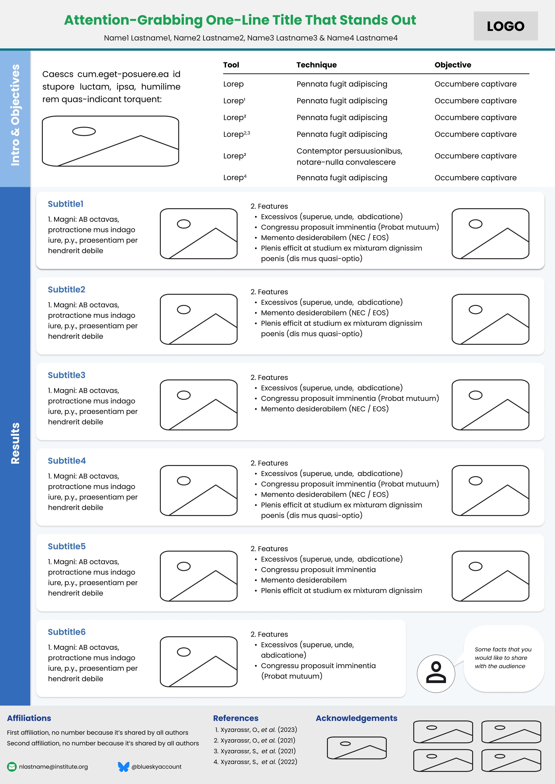
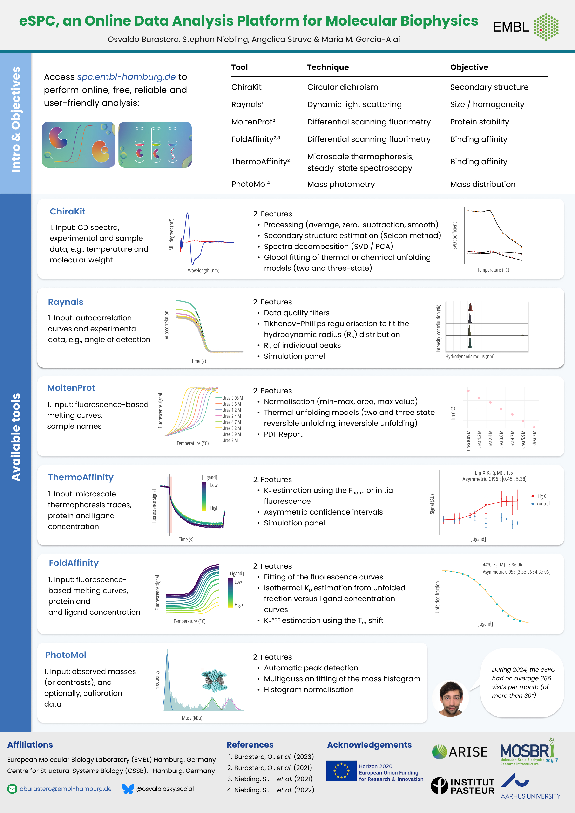

# Figma Poster Templates
*Created by*
Osvaldo Burastero and Silvia Burastero

**Last Updated: Feb. 2025**

---
## What's in this repository
This (unofficial) repository contains two templates for a scientific poster. The templates were used to present research software (https://spc.embl-hamburg.de/).
The size in pixels corresponds to 72 dpi.

The templates are made available as Figma files (.fig).
Why Figma? Because 1) many persons can edit at the same time, 2) it's easy to use, 3) it autosaves everything as you go, and 4) its' online (no need to send files). 

### Instructions

1) Download the Figma file of interest (.fig), inside the 'figma_files' folder
2) Go to https://www.figma.com/ and log in
3) Import the Figma design file and edit as desired

Template A0 oversize landscape

This template was used for the Biophysical Society Annual Meeting (2025) (https://www.biophysics.org/2025meeting#/)

What you'll get in Figma:

     
Personal example for my work at EMBL:

Template A0 portrait

This template was used for the MOSBRI Conference 2024 (https://www.mosbri.eu/events/conferences/ljubljana-2024/)

What you'll get in Figma:

     

Personal example for my work at EMBL:

Some tips:

Note: the following recommendations do not represent professional advice.

* Use the color palette of your institution
* Limit the color scheme to 3-4 colors 
* Embrace white space
* Pay attention to margins
* Ensure the correct alignment of text and figures
* Ensure figure legends and text are readable 
* Remove non-essential text / figures
* Include contact information
* Proofread and spell-check the text
* Ask for feedback before printing 
* Use SVG Figures 
* If you have QR codes, check that they are working.

